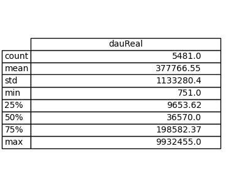
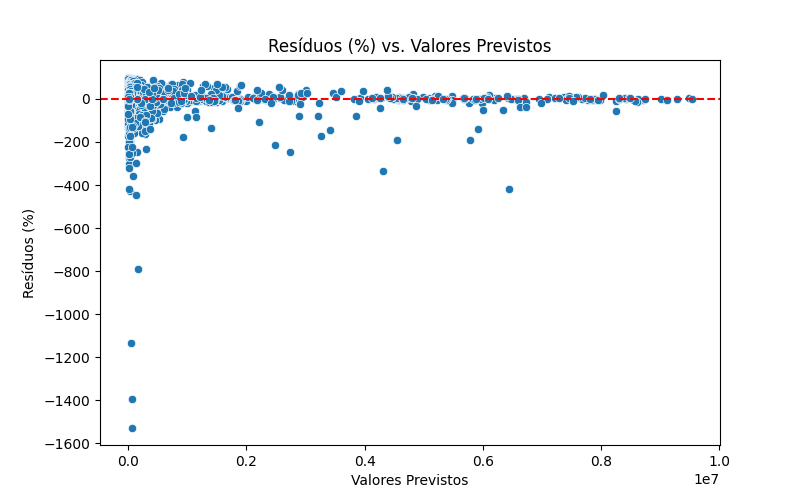
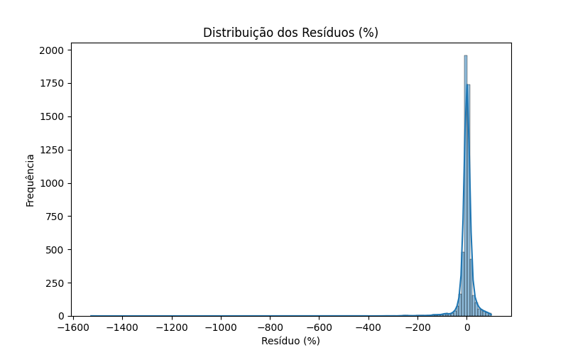
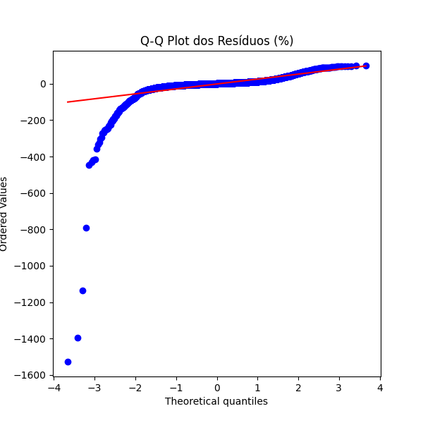

# Relatório - Case Técnico - Cientista de Dados Sênior - Lucas Benazzi Cestari

### Contextualização
Esse relatório ira passar por todas as etapas do projeto, descrevendo todos os notebooks, os resultados observados, possíveis melhorias e próximos passos.

### Objetivo do projeto
Utilizar os dados disponíveis para prever a quantidade de **Daily Active Users (DAU)** de cada aplicativo.

---

## Visão geral do projeto
O projeto seguiu as seguintes etapas:
1. Exploração inicial do banco de dados e armazenamento dos dados brutos de interesse.
2. Tratamento e limpeza dos dados por meio de investigações dos casos de erro.
3. Extração de características e preparo dos dados para serem utilizados no treinamento do modelo.
4. Treinamento do modelo.
5. Validação do modelo e análise dos resultados.
6. Conclusão.
7. Melhorias e próximos passos.

---

## 1. Armazenamento inicial dos dados. ([1_baixar_arquivo.ipynb](../notebooks/1_baixar_arquivo.ipynb))
Foi feito uma exploração inicial dos dados para entender como melhor utilizar eles para fazer a previsão do DAU. Como não se teve acesso a nenhuma informação externa, todo o conhecimento foi derivado somente dos nomes das tabelas, nome das colunas e os valores dos dados em si.

Após consultas exploratórias pontuais, foi decidido que todas os dados e tabelas disponíveis seriam de interesse para o treinamento do modelo. Utilizando as chaves "appId" e "date", foram cruzadas as seguintes tabelas:
* daumau
* desinstalacoes
* installs
* ratings_reviews

---

## 2. Tratamento e limpeza dos dados. ([2_limpar_dados.ipynb](../notebooks/2_limpar_dados.ipynb))
Como não temos acesso ao contexto de como os dados são armazenados, foram feitas diversas presunções para poder fazer a limpeza dos dados nessa etapa. Segue a lista de ajustes:
* Deletar linhas que não apresentam valor de "appId".
* Validação que todos os valores de "appId" restantes apresentam o mesmo padrão.
* Desconsiderar valores com datas inválidas.
    * Somente dados de 2024 foram identificados como corretos.
* Deletar dados duplicados.
* Validação que não existem casos de ter diversas combinações de "appId" e "date".
* Adição de todas as combinações de "appId" e "date" restantes.
    * Para facilitar as etapas seguintes, é interessante garantir que existe todas as combinações de "appId" e "data", mesmo que apresentem somente zeros.
* Desconsideração das colunas "country" e "lang".
    * Ambas as colunas apresentavam um único valor e, portanto, não agregavam nenhuma informação.
* Preencher os valores de "category" conforme a categoria do aplicativo na avaliação.
    * Não foram encontrados nenhum aplicativo com mais de uma categoria. Portanto, caso fosse identificado um valor nulo de "category", esse valor foi substituído pela categoria correspondente daquele aplicativo.
    * Para casos em que não foi localizado uma categoria correspondente, foi atribuído a categoria "NO_CATEGORY" para o aplicativo.
* Interpolação, quando possível, dos valores cumulativos de "ratings" e "reviews".
    * Ainda restaram casos em que os primeiros valores de "ratings" e "reviews" eram nulos. Para esses casos, como não é possível deduzir o que estava acontecendo com o aplicativo nessa época, os valores nulos foram substituídos por zero.
    * Não foram localizados casos de "valores finais nulos" para "ratings" e "reviews".
* Recalculação das colunas "daily_ratings" e "daily_reviews" com os novos dados interpolados e substituídos de "ratings" e "reviews".
* Interpolação dos dados, quando possíveis, de "mauReal" e "predictionLoss".
* Replicar dados finais e inicias para os casos de valores nulos restantes de "mauReal".
* Substituição por zero dos valores nulos de "newinstalls".
    * Estamos presumindo que, pela natureza desse dado, é uma informação mais garantida de estar correta. Portanto, valores nulos provavelmente ocorrem somente quando não foram feitas instalações novas.
* Interpolação dos valores de "dauReal", somente quando "mauReal" é maior que zero.
    * Essa regra acabou sendo redundante, pois quase todos os casos em que "dauReal" era nulo havia um valor válido de "mauReal". Entretanto, essa abordagem ajuda a evitar os caso em temos um período grande com somente valores mensais e sem dados diários, o que não é possível.
    * Devido à importância desses dados, seria ideal investigar todos os casos e saber exatamente quando esse valor deveria ser zero, e quando deveria ser interpolado.
* Replicar dados iniciais nulos "dauReal".
    * Foi localizado somente um único caso de "valores iniciais nulos" de "dauReal". Nesse caso, os demais valores pareciam estar preenchidos corretamente, incluindo daily_reviews, o que indica que ocorreu algum problema técnico que afetou somente o valor de "dauReal".
* Validação da ordem de grandeza de todos os valores.
    * Apesar da grande variação de magnitude de alguns campos, como "dauReal", não foi identificado um valor obviamente incorreto.
    * Mais investigações nessa área ainda poderiam ser feitas. 

---

## 3. Extração de características. ([3_extracao_de_caracteristicas.ipynb](../notebooks/3_extracao_de_caracteristicas.ipynb))
Conforme ocorre em muitos casos de treinamento de modelos, tornar explícitos certas informações já existentes nos dados pode auxiliar o desempenho dos modelos. Segue a lista de ajustes:
* Adição da informação booleana de "é feriado ou final de semana" para todos os dias.
    * Como temos diversas categorias de aplicativos, esperamos que algumas categorias, se não todas, possuem forte relação com dias de semana, finais de semana, e feriados.
* Codificação cíclica temporal de:
    * Semana
    * trimestre
    * Ano
    * Meia década
* Adição de média móvel, para o período anterior de 3 e 7 dias, dos seguintes valores:
    * dauReal
    * mauReal
    * newinstalls
    * ratings
    * reviews
* Cálculo do valor anterior e futuro de "dauReal".
    * O valor anterior será utilizado para melhorar a desempenho do modelo.
    * O valor futuro será o próprio valor calculado pelo modelo.
* One-hot-encoding da coluna "category"
* Label encoding da coluna "appId".
    * O LabelEncoder é armazenado em arquivo apartado para poder ser consultado e manter o padrão de todos os arquivos futuros.

## 4. Treinamento do modelo. ([4_treinar_modelo.ipynb](../notebooks/4_treinar_modelo.ipynb))
O treinamento do modelo foi feita de forma direta, sem um processo iterativo para definir os melhores hiperparametros, e desconsiderando os últimos 30 dias dos dados disponíveis para realizar o treinamento. Dos dados utilizados para o treino, os primeiros 80% foram utilizados para treinar o modelo, e os 20% finais foram utilizados para testar o modelo.

Foi utilizado o modelo XGBoost com os seguintes hiperparametros:
* objective = 'count:poisson'
* n_estimators = 1200
* learning_rate = 0.2
* max_depth = 6
* random_state = 42

Segue o resumo das métricas de avaliação do modelo:
- MSLE: 0.0242
- MAPE: 0.1262
- MAE: 20122.3173
- R2: 0.9943

Os resultados serão discutidos na próxima etapa.

---

## 5. Validação do modelo. ([5_validacao_do_modelo.ipynb](../notebooks/5_validacao_do_modelo.ipynb))
Esse notebook serve tanto para validar o modelo, quanto para fazer outras validações pontuais ao alterar as variáveis "data_minima" e "data_maxima". O notebook passa por todo o processo de preparo dos dados, dessa vez filtrando pelo período específico, e utilizando o modelo já treinado. Seguem as etapas:
* Baixar os arquivos do banco de dados.
* Fazer a limpesa dos dados.
* Extração das características e preparo dos dados.
* Predição dos dados utilizando o modelo treinado na **etapa 4**.

Para auxiliar na organização do projeto, o script [funcoes.py](../notebooks/funcoes.py) foi criado para organizar as funcionalidades dos notebooks 1, 2 e 3.

Validando os dados com os últimos 30 dias disponíveis, temos as seguintes métricas de avaliação do modelo:

- MSLE: 0.1155
- MAPE: 0.1537
- MAE: 53698.7509
- R2: 0.9480

Como é de se esperar, ocorreu uma queda no desempenho no processo de validação em comparação com o processo de treinamento.

Antes de seguir, é importante ter em mente a distribuição dos valores que estamos querendo prever:

Como podemos observar, temos uma margem extremamente grande entre os valores mínimos e máximos do dauReal, isso quer dizer, por exemplo, que um MAE de 50k pode ser extremamente bom para alguns casos, mas extremamente ruin para outros. Valores reduzidos de MSLE e MAPE indicam que, apesar do erro bruto poder ser significativo para alguns casos, o modelo apresenta um resultado positivo e promissor. Ter um valor alto de R2 também indica que o modelo explica grande parte da variança dos dados.

Devido à grande magnitude de **dauReal**, as análises em seguir dos resíduos foram feitas com base no erro percentual, e não bruto.

Como podemos observar nos gráficos, em geral, o resultado do modelo se demonstrou promissor, conforme as métricas de desempenho. Entretanto, fica evidente que o modelo apresenta problemas significativos. Apesar de apresentar um desempenho bom, na maior parte, existem alguns casos em que o erro é muito expressivo.

Como podemos observar no gráfio de Q-Q Plot, por exemplo, o modelo consegue representar corretamente os valores para a maioria dos casos. Entretanto, existem alguns valores que o modelo faz uma previsão muito menor que o valor real. Conseguimos tirar a mesma conclusão dos outros gráficos também, ambos os gráficos evidenciam que existe uma minoria de resíduos negativos muito expressivos.

## 6. Conclusão.

Apesar das métricas de avaliação sugerir que o modelo é promissor, não é aconselhável utilizar o modelo no seu estado atual até entender exatamente o que está causando esses erros extremos, mesmo que incomuns. Provavelmente, podemos atribuir esses erros mais acentuados a alguns aplicativos específicos, categorias específicas, ou durante algum período específico. Ou seja, retirando esses casos, apesar de não ideal, pode já trazer benefícios ao negócio antes de conseguir resolver os problemas do modelo. De qualquer forma, o ideal ainda é mapear o problema e ter um modelo que se adeque a essas situações.

---

## 7. Próximos passos e melhorias.

Devido à limitação de tempo, não foi possível realizar todas as etapas e análises desejadas. Por exemplo, em geral, é aconselhável explorar mais os dados antes da criação do modelo, entender quais aplicativos possuem mais usuários, quais possuem menos, correlacionar os valores de todas as colunas, etc. Além disso, seria interessante testar outras abordagens para o processo de limpeza e preparo dos dados, como incluir ou desconsiderar alguns dados, a fim de tentar melhorar o desempenho do modelo.

Em relação ao treinamento do modelo, tendo em vista que ele apresentou alguns poucos erros, mas muito expressivos, é interessante tentar outras abordagens. O problema principal parece derivar do fato que aplicativos diferentes apresentam comportamentos de usuários muito diferentes. Isso dificulta que um modelo consiga aprender todas as relações presente nos dados.

Portanto, algumas abordagens se demonstram interessantes:
* Realizar a transformação log dos valores antes de treinar o modelo.
    * Isso ajuda a lidar com o problema da grande variação dos dados, mas não ajuda a lidar com o problema que aplicativos apresentarem comportamentos muito diferentes.
* Tentar outros modelos e/ou unificar o resultado de diversos modelos.
    * Isso pode ajudar a modelar os diferentes comportamentos dos aplicativos, mas não deve resolver o problema da grande variação dos dados.
* Treinar um modelo por aplicativo e unificar o resultado dos modelos.
    * Devido à natureza da situação, não esperamos que um mesmo aplicativo apresente variações tão grande de DAU. Ou seja, não esperamos precisar lidar com o problema da grande variação dos dados quando olhando um aplicativo por vez.
    * Isso deve auxiliar a modelar melhor a relação que cada aplicativo tem com os usuários.
    * Entretanto, perdemos a possibilidade de analisar possíveis relações entre os aplicativos seguindo essa abordagem, pois cada modelo perderia a visão dos outros aplicativos.